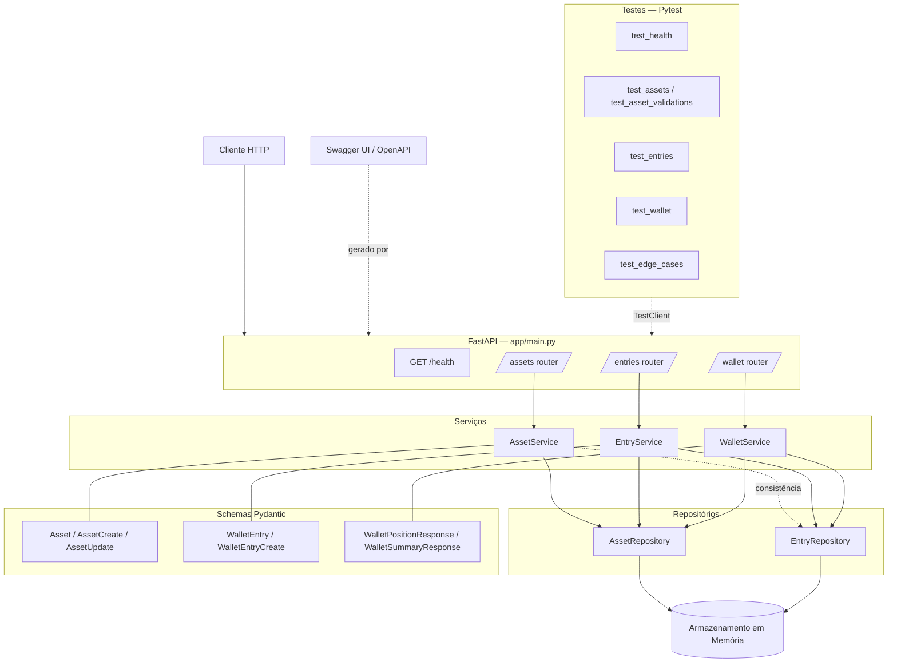

← [README principal](../README.md) · [Índice da documentação](README.md)

# Arquitetura — Personal Wallet API

## Visão geral

A aplicação segue uma arquitetura em camadas com separação clara de responsabilidades:

| Camada | Localização | Responsabilidade |
|---|---|---|
| **Routers** | `app/routers/` | Receber requisições HTTP, validar entrada e retornar resposta |
| **Services** | `app/services/` | Aplicar regras de negócio e orquestrar operações |
| **Repositories** | `app/repositories/` | Persistir e recuperar dados do armazenamento em memória |
| **Schemas** | `app/schemas/` | Definir contratos de entrada e saída via Pydantic |

O ponto de entrada da aplicação é `app/main.py`, que instancia o app FastAPI e registra os routers.

## Componentes principais

- **`AssetService`** — gerencia ativos, incluindo validações de domínio (unicidade de symbol, normalização de uppercase) e verificação de consistência antes de remoção.
- **`EntryService`** — gerencia entradas/transações, validando a existência do ativo referenciado.
- **`WalletService`** — calcula posições consolidadas e resumo da carteira a partir das entradas registradas.
- **`AssetRepository` / `EntryRepository`** — armazenamento em memória via `dict[UUID, T]`. Os dados são perdidos ao reiniciar a API.
- **`app/dependencies.py`** — instâncias singleton dos repositórios, compartilhadas entre services para garantir consistência de estado.

## Como ler o diagrama

- **Setas sólidas** (`-->`) indicam chamadas diretas entre componentes.
- **Setas tracejadas** (`-.->`) indicam dependências indiretas (consistência, geração de documentação, uso em testes).
- O bloco **Armazenamento em Memória** representa o estado em `dict` dentro de cada repositório.

## Diagrama de componentes

> O arquivo Mermaid bruto está disponível em [`arquitetura-componentes.mmd`](arquitetura-componentes.mmd).

---

← [README principal](../README.md) · [Índice da documentação](README.md)
